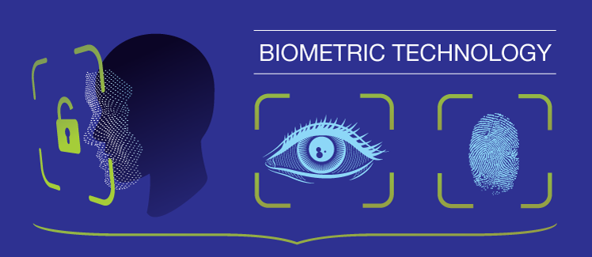

# BiometricX

The easy way to use biometric authentication in your Flutter app.\
Supports Fingerprint, FaceID and Iris.

[Demo APK](https://github.com/salkuadrat/BiometricX/raw/master/BiometricX.apk).



## Starting

Published soon at...

```
$ flutter pub add biometricx
```

## Configuration

Change your android `MainActivity` to extends `FlutterFragmentActivity`.

```kotlin
import io.flutter.embedding.android.FlutterFragmentActivity

// kotlin
class MainActivity: FlutterFragmentActivity() {
  ...
}
```

```java
import io.flutter.embedding.android.FlutterFragmentActivity;

// java
class MainActivity extends FlutterFragmentActivity {
  ...
}
```

## Usage

 to check biometric type of your device.

```dart
BiometricType type = await BiometricX.type();
```

Here is the list of biometric types.

```dart
BiometricType.FACE
BiometricType.FINGERPRINT
BiometricType.IRIS
BiometricType.MULTIPLE
BiometricType.NONE
BiometricType.NO_HARDWARE
BiometricType.UNAVAILABLE
BiometricType.UNSUPPORTED
```

To check if your device can use biometric authentication.

```dart
bool isBiometricEnabled = await BiometricX.isEnabled();
```

To encrypt data using biometric authentication.

```dart
BiometricResult result = await BiometricX.encrypt({
  biometricKey: 'salkuadrat',
  message: 'This is a very secret message',
});

if (result.isSuccess && result.hasData) {
  // Keep this messageKey to decrypt your message.
  // This messageKey will be randomly generated by BiometricX plugin.
  String messageKey = result.data!;
} else {
  showToast(result.errorMsg, context: context);
}
```

If you need a persistent `messageKey`, you can supply it as parameter to `encrypt`.

```dart
BiometricResult result = await BiometricX.encrypt({
  biometricKey: 'salkuadrat',
  messageKey: 'secret_message', // use persistent messageKey
  message: 'This is a very secret message',
});

if (result.isSuccess && result.hasData) {
  // Keep this messageKey to decrypt your message.
  // This will be the same value as messageKey above ('secret_message')
  String messageKey = result.data!;
} else {
  showToast(result.errorMsg, context: context);
}
```

To decrypt data using biometric authentication.

```dart
// Use the same biometricKey that is used to encrypt your message.
// Use messageKey that you get from [BiometricX.encrypt].
BiometricResult result = await BiometricX.decrypt({
  biometricKey: 'salkuadrat',
  messageKey: messageKey,
});

if (result.isSuccess && result.hasData) {
  // This will contains your original message.
  String message = result.data!;
} else {
  showToast(result.errorMsg, context: context);
}
```

To show custom message in your biometric prompt dialog, method `encrypt` and `decrypt` have parameters you can use to change the biometric prompt dialog.

```dart
BiometricResult result = await BiometricX.encrypt({
  biometricKey: 'salkuadrat',
  message: 'This is a very secret message',
  title: 'Biometric Encryption',
  subtitle: 'Enter biometric credentials to encrypt your message',
  description: 'Scan fingerprint or face.',
  negativeButtonText: 'USE PASSWORD',
  confirmationRequired: true,
});
```

```dart
BiometricResult message = await BiometricX.decrypt({
  biometricKey: 'salkuadrat',
  messageKey: messageKey,
  title: 'Biometric Decryption',
  subtitle: 'Enter biometric credentials to decrypt your message',
  description: 'Scan fingerprint or face.',
  negativeButtonText: 'USE PASSWORD',
  confirmationRequired: true,
});
```

## Example

[Example project](example).\
[Demo APK](https://github.com/salkuadrat/BiometricX/raw/master/BiometricX.apk).